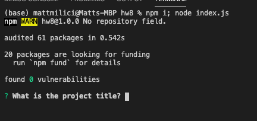

# CLI README Generator

## Description

The purpose of this project is to help save developers time when creating a README.md file. This project will prompt the user with specific questions that every README should have and styling it in an easy to read format with active links and badges.

## Table of Contents

- [Description](#Description)
- [Installation](#Installation)
- [Usage](#Usage)
- [License](#License)
- [Contributing](#Contributing)
- [Questions](#questions)

## Installation

First, start by running "npm init", then run "node index.js" to begin being prompted.

## Usage

This project should be used at the beginning of the project in order to setup the standard README template

## License

## Contributing

Please use the contact information under Questions to provide any feedback!

## Tests

Test the project by running node index.js in your terminal. Please note, you will have to be in the correct director in order to have the README created in the correct location.

## Questions

My email is: test@gmail.com

[Go to the GitHub Web Site](https://github.com/test-mar)

<!-- https://drive.google.com/file/d/1uaq30j4oUvyC_qzXMb5q9VFOQhwjRacS/view -->
